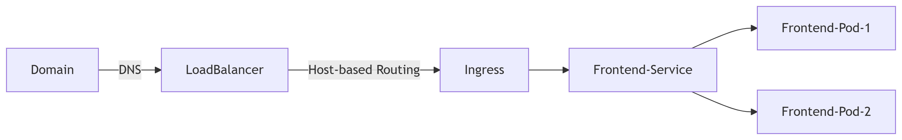

# Ingress

The Ingress concept lets you map traffic to different backends based on rules you define via the Kubernetes API.

Sample flow of ingress implementation in production env.

There are three main concept to setup ingress

1. Ingress class
2. Ingress Controller
3. Ingress Object

Ingress controller is main part or main object which play critical role in this. As without this there is no use of ingress object. As when we install controller in cluster in will create an service of type loadbalancer. (mostly we use virtual machine provided by cloud provider they required necessary permission to deploy this loadbalncer in cloud). Once ingress controller is setup we can now deployed our ingress which specify routing rules. All mentioned rule is set in load balancer. 

### IngressClass
Ingresses can be implemented by different controllers, often with different configuration. Each Ingress should specify a class, a reference to an IngressClass resource that contains additional configuration including the name of the controller that should implement the class.

### Default IngressClass
You can mark a particular IngressClass as default for your cluster. Setting the ingressclass.kubernetes.io/is-default-class annotation to true on an IngressClass resource will ensure that new Ingresses without an ingressClassName field specified will be assigned this default IngressClass.There are some ingress controllers, that work without the definition of a default IngressClass. For example, the Ingress-NGINX controller can be configured with a flag --watch-ingress-without-class. It is recommended though, to specify the default IngressClass

